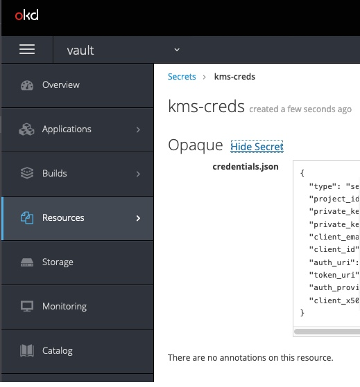

## Setup for vault with GCP Auto-Unseal

This example covers how to spin up a vault HA Raft cluster with seal type GCP Auto-unseal.

The `values.yaml` in this can be used for this, however, there are couple of things needs to be staged before this. 
Reference: https://www.vaultproject.io/docs/platform/k8s/helm/run#google-kms-auto-unseal

1. #### Create a secret with GCP credentials
   Vault Helm requires the Google Cloud KMS credentials stored in `credentials.json` and mounted as a secret in each Vault server pod.
   Here's how you can create it:

   ```
   ## create secret
   $ oc create secret generic kms-creds --from-file= credentials.json
    secret/kms-creds created

   ## confirm secret creation
   $ oc get secret kms-creds
    NAME        TYPE      DATA      AGE
    kms-creds   Opaque    1         2m
    ```
    By default Vault Helm mounts this to `/vault/userconfig/kms-creds/credentials.json`. You can see your `json` stored as secret as below:

    

2. #### Configure values.yaml with gcp config

   There are couple of configurations you have to define here:

   a. Setup environment variable:

   ```
   server:
   extraEnvironmentVars:
    GOOGLE_REGION: global
    GOOGLE_PROJECT: <PROJECT NAME>
    GOOGLE_APPLICATION_CREDENTIALS: /vault/userconfig/kms-creds/credentials.json
   ```

    b. Setup secret volumes:

    ```
    extraVolumes:
    - type: 'secret'
      name: 'kms-creds'
    ```

    c. Lastly, configure the seal stanza

    ```
     config: |
      ui = true

      listener "tcp" {
        tls_disable = 1
        address = "[::]:8200"
        cluster_address = "[::]:8201"
      }

      seal "gcpckms" {
        project     = "<NAME OF PROJECT>"
        region      = "global"
        key_ring    = "<NAME OF KEYRING>"
        crypto_key  = "<NAME OF KEY>"
    ```