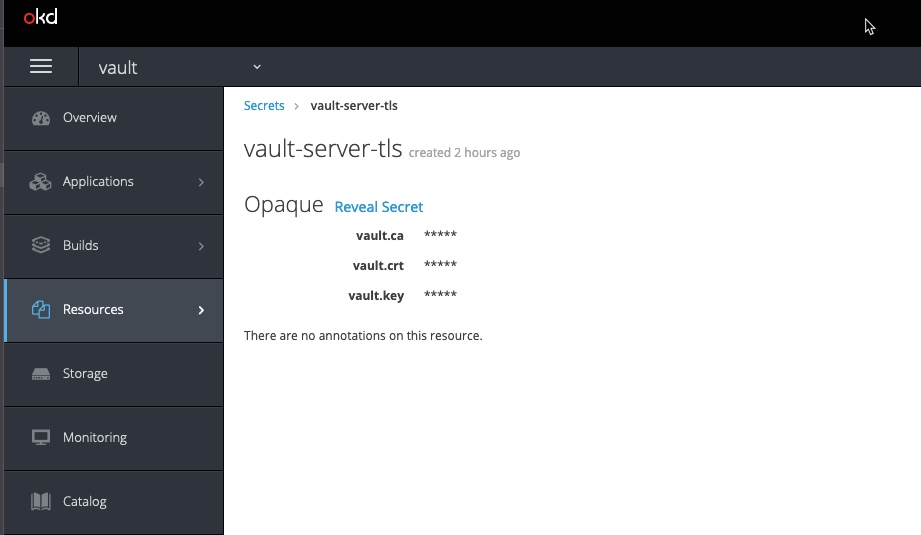

## Setup for vault with TLS enable

This is an example of running Vault on Openshift with TLS enable. 
There are couple of steps you would need to do to have it work, explained below:

1. ###### Patch your minishift : 
   The minishift binary has as cluster signing cert and key configuration missing in Kube-api process, hence you would have to patch it first. Here's what to do: 
   
   ```
   ## bring up minishit
   $ minishift start

   ## then login as admin 
   $ oc login -u system:admin # this will ask for password the default password is admin

   ## once done run this patch

   $ minishift openshift config set --target=kube --patch '{
		"kubernetesMasterConfig": {
		    "controllerArguments": {
		        "cluster-signing-cert-file": ["/etc/origin/master/ca.crt"],
		        "cluster-signing-key-file": ["/etc/origin/master/ca.key"]
			  }
		}
        }'
   ```

2. ###### Create certificate signing authority and push secret in vault namespace

   Next you create a seceret for Vault in Openshift to be consumed Vault. This secret will have 3 values stored in it:
   >     a. vault.ca
   >     b. vault.crt
   >     c. vault.key
 
   These are the values which will be used in Vault config file to enable tls on vault listener 

   Detailed process for the same is defined [here](https://www.vaultproject.io/docs/platform/k8s/helm/examples/standalone-tls).
   However, for this repo, you can run script cert.sh and it will set all this up for you.

   ```
   ## make sure minishift is up and patch mentioned in Step 1 is completed

   $ ./cert.sh
   ```

   Following this, you should be able to see following secrets on your opneshift instance

   

3. ###### Update values.yaml
    Now, you need to update your `values.yaml` file with appropriate vault config. 
    The `values.yaml` in this path already has all these setup, so you can essentially use it as it is. But here are the changes it do:

    a. Set `tlsDisable` to `false`.
    ```
    global:
    enabled: true
    tlsDisable: false
    ```
    b. Pass env var `VAULT_CACERT` to point to recently created `ca`
    ```
    server:
    extraEnvironmentVars:
    VAULT_CACERT: /vault/userconfig/vault-server-tls/vault.ca 
    ```
    c. Mount a new volume for the secret, make sure the name has to be same as secret created above
    ```
      extraVolumes:
        - type: secret
          name: vault-server-tls 
    ```
    d. Lastly your vault config:
    ```
    config: |
        ui = true

        listener "tcp" {
          #tls_disable = 1
          address = "[::]:8200"
          cluster_address = "[::]:8201"
          tls_cert_file = "/vault/userconfig/vault-server-tls/vault.crt"
          tls_key_file  = "/vault/userconfig/vault-server-tls/vault.key"
          tls_client_ca_file = "/vault/userconfig/vault-server-tls/vault.ca"
        }
    ```

5. ###### Set kubernetes CA CERT as environment variable

   Depending on minishift version, there can be chances that when you run the `vault.sh`. The standby node might not be able to join active node automatically. I will se this as command at some point in script. But if you see this issue, this what you need to do

   ```
   ## rsh in you openshift container
   $ oc rsh vault-1

   ## set enviornment variable
   $ export CA_CERT=`cat /var/run/secrets/kubernetes.io/serviceaccount/ca.crt`

   ## join the standby node to active
   $ vault operator raft join -leader-ca-cert="$CA_CERT" https://vault-0.vault-internal:8200

   ```